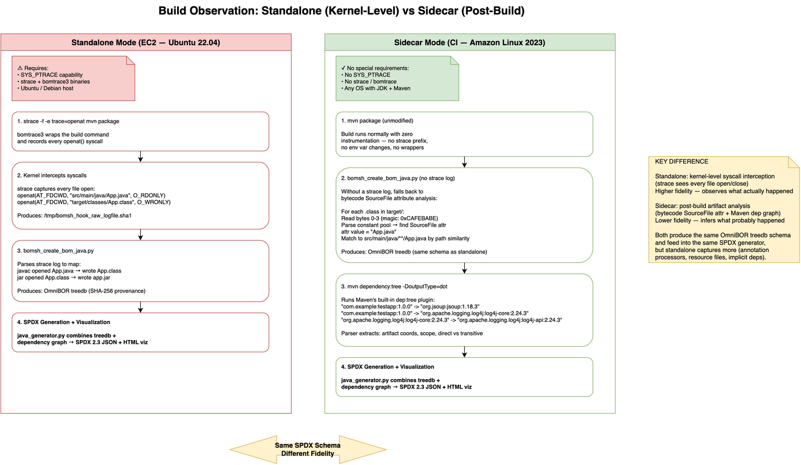

# OmniBOR Java Test Application

A realistic Java application for **end-to-end validation** of the OmniBOR
sidecar SPDX generation pipeline in CI/CD environments.

This project simulates a real product team integrating OmniBOR's sidecar
container into their existing CI/CD pipeline to produce SPDX 2.3 SBOMs
without requiring `SYS_PTRACE`, `strace`, or any kernel-level build
interception.

## Architecture

[](docs/architecture.png)
*Click to view full-size diagram ([editable source](docs/architecture.drawio))*

| Component | Description |
|-----------|-------------|
| **Test App** | Maven project depending on jsoup, Log4j2, Bouncy Castle |
| **CI Pipeline** | GitHub Actions: build on Amazon Linux 2023 / Corretto 21 |
| **Sidecar** | `ghcr.io/tedg-dev/omnibor-sidecar` — generates SPDX from build artifacts |
| **Output** | SPDX 2.3 JSON uploaded as CI artifacts |

## Why This Project Exists

The OmniBOR standalone pipeline runs on Ubuntu 22.04 with OpenJDK and
uses `strace` + `bomtrace3` (requiring `SYS_PTRACE` capability) to
intercept build commands. This is unsuitable for most enterprise CI/CD
environments where:

- Containers run without elevated capabilities
- The build OS may be Amazon Linux, RHEL, or Alpine — not Ubuntu
- The JDK vendor may be Corretto, Temurin, or GraalVM — not OpenJDK
- Teams cannot modify their build process to add strace wrappers

The **sidecar mode** solves this by running alongside the build without
any kernel instrumentation. This test project proves it works in a
realistic, non-Ubuntu, non-OpenJDK environment.

## Environment Comparison

The sidecar pipeline uses two completely independent containers that
share **nothing** — different OS, different package manager, different
JDK vendor, and different installed software. The CI build container
runs the project's normal build with zero modifications. The sidecar
container then analyzes the build artifacts to generate SPDX.

### CI Build Container

The project builds inside the team's own container image — no OmniBOR
tooling is installed, and the build command is unmodified:

| Aspect | Detail |
|--------|--------|
| **Base image** | `amazoncorretto:21-al2023` |
| **OS family** | Amazon Linux 2023 (Fedora-based, `dnf` / `rpm`) |
| **JDK vendor** | Amazon Corretto 21 |
| **JAVA_HOME** | `/usr/lib/jvm/java-21-amazon-corretto` |
| **Maven** | Apache 3.9.8 (`archive.apache.org` tarball) |
| **Build command** | `mvn package -q` (unmodified — no wrappers) |
| **Build instrumentation** | **None** |
| **SYS_PTRACE** | **Not used** |
| **strace / bomtrace** | **Not installed** |
| **Python** | Not installed |
| **Go / Rust / C toolchains** | Not installed |
| **bomsh scripts** | Not installed |
| **Other packages** | `tar`, `gzip`, `curl` (via `dnf`) — nothing else |

### Sidecar Analysis Container

After the build completes, the sidecar container
(`ghcr.io/tedg-dev/omnibor-sidecar`) runs on the same build artifacts:

| Aspect | Detail |
|--------|--------|
| **Base image** | `ubuntu:22.04` (Debian-based, `apt` / `dpkg`) |
| **JDK** | OpenJDK 17 + 21 (Ubuntu apt) |
| **JAVA_HOME** | `/usr/lib/jvm/java-21-openjdk-amd64` |
| **Maven** | Apache 3.9.15 + 3.6.3 |
| **Python** | 3.x + omnibor-analysis pipeline |
| **Analysis method** | Bytecode SourceFile attr + `mvn dependency:tree` |
| **bomsh scripts** | `bomsh_create_bom_java.py` (bytecode reader only) |
| **Build instrumentation** | **None** — no strace, no bomtrace |
| **SYS_PTRACE** | **Not required** |
| **Output** | SPDX 2.3 JSON (build + analyzed) + HTML visualizations |

### Key Differences Between Containers

| Aspect | CI Build | Sidecar Analysis |
|--------|---------|-----------------|
| **OS** | Amazon Linux 2023 (rpm) | Ubuntu 22.04 (deb) |
| **JDK vendor** | Amazon Corretto | OpenJDK |
| **Package manager** | `dnf` | `apt` |
| **Python** | Not installed | Installed (runs pipeline) |
| **bomsh** | Not installed | bytecode reader only |
| **Build runs here?** | **Yes** | No (reads artifacts) |
| **SPDX generated here?** | No | **Yes** |
| **Privileged capabilities** | None | None |

## Dependencies

Chosen to exercise different dependency graph shapes:

| Dependency | Version | Why |
|-----------|---------|-----|
| **jsoup** | 1.18.3 | HTML parser — zero transitive deps |
| **Log4j2** | 2.24.3 | Logging — multi-module transitive tree |
| **Bouncy Castle** | 1.80 | Crypto provider — substantial dep tree |
| JUnit 4 | 4.13.2 | Test only — excluded from production SPDX |

## How It Works

[](docs/ci-pipeline-flow.png)
*Click to view full-size diagram ([editable source](docs/ci-pipeline-flow.drawio))*

### 1. Build Phase (Amazon Linux 2023)

The GitHub Actions workflow builds the project inside an
`amazoncorretto:21-al2023` Docker container:

```
docker run amazoncorretto:21-al2023 \
    bash -c "dnf install -y maven && mvn package -q"
```

This produces `target/omnibor-java-testapp-1.0.0.jar` with all compiled
`.class` files. The build runs on a completely different OS and JDK than
our standalone analysis environment.

### 2. Sidecar Analysis Phase

[](docs/build-interception.png)
*Click to view full-size diagram ([editable source](docs/build-interception.drawio))*

After the build, the OmniBOR sidecar container runs:

```
docker run ghcr.io/tedg-dev/omnibor-sidecar:latest \
    python3 /workspace/app/analyze.py \
    --repo omnibor-java-testapp --mode sidecar --skip-clone
```

The sidecar performs two independent analyses:

#### a) Bytecode Provenance (bomsh\_create\_bom\_java.py)

Scans every `.class` file in `target/` and reads the `SourceFile`
bytecode attribute (inserted by `javac` per JLS §13.1). This maps
each class back to its `.java` source file without needing strace.

#### b) Dependency Graph (mvn dependency:tree)

Runs `mvn dependency:tree -DoutputType=dot` to capture the full
declared dependency graph in DOT format. The parser extracts:

- **Direct dependencies** (compile scope → `DEPENDS_ON`)
- **Transitive dependencies** (pulled in by direct deps → `DEPENDS_ON`)
- **Test-scope dependencies** (excluded from production SPDX)
- **Optional/provided scope** (annotated but included)

### 3. SPDX Generation

[](docs/spdx-generation.png)
*Click to view full-size diagram ([editable source](docs/spdx-generation.drawio))*

The Java SPDX generator (`app/spdx/java_generator.py`) combines both
data sources into SPDX 2.3 JSON documents:

| SBOM Type | Contents | Relationship Types |
|-----------|---------|-------------------|
| **Build** | Root package + all deps + build tools | `DEPENDS_ON`, `BUILD_TOOL_OF`, `DESCRIBES` |
| **Analyzed** | Root package + all deps (no build tools) | `DEPENDS_ON`, `DESCRIBES` |

Build tools detected and emitted as `BUILD_TOOL_OF`:

- **javac** (JDK compiler) — version from `javac -version`
- **Maven** — version from `mvn --version`

### 4. Artifacts

SPDX JSON files are uploaded as GitHub Actions artifacts, downloadable
via:

```bash
gh run download --repo tedg-dev/omnibor-java-testapp \
    --name spdx-output --dir ./spdx-output
```

## Performance Benchmarks

Each CI run executes two parallel jobs on identical GitHub Actions
runners: a **baseline** (build only) and an **instrumented** run
(build + sidecar SPDX). The sidecar adds zero overhead to the build
itself — all analysis runs post-build.

### Baseline vs Instrumented

<!-- Update this table after each CI run -->
| Run | Date (UTC) | Baseline Build | Instrumented Build | Sidecar Analysis | Instrumented Total | Overhead | Overhead % |
|-----|-----------|---------------|-------------------|-----------------|-------------------|----------|-----------|
| 6 | 2026-05-08 23:27 | 32s | 32s | 20s (14.4s pipeline) | 52s | +20s | **+63%** |
| 5 | 2026-05-08 23:17 | ~36s *(est.)* | 36s | 20s (14.1s pipeline) | 56s | +20s | **+56%** |

### Sidecar Analysis Phase Breakdown

The sidecar analysis (Phase 1 + Phase 2) runs inside the sidecar
container after the build completes:

| Run | Date (UTC) | Phase 1: Build Interception | Phase 2: SPDX Generation | Total Analysis | Notes |
|-----|-----------|---------------------------|-------------------------|---------------|-------|
| 6 | 2026-05-08 23:27 | ~10s *(est.)* | ~4s *(est.)* | 14.4s | Pipeline 14.4s; CI step 20s (includes container startup) |
| 5 | 2026-05-08 23:17 | ~10s *(est.)* | ~4s *(est.)* | 14.1s | Pipeline 14.1s; CI step 20s (includes container startup) |

**Phase 1 — Build Interception** includes:
- `mvn clean` + `mvn package -DskipTests` (re-build inside sidecar)
- `bomsh_create_bom_java.py` (bytecode SourceFile attr → treedb)
- `mvn dependency:tree -DoutputType=dot` (dep graph capture)

**Phase 2 — SPDX Generation** includes:
- `java_generator.py` (treedb + dep graph → SPDX 2.3 JSON)
- Build tool detection (`javac -version`, `mvn --version`)
- SPDX validation (semantic checks)
- HTML visualization generation (D3.js force-graph)

### CI Run Log

| # | Date (UTC) | Result | Commit | Notes |
|---|-----------|--------|--------|-------|
| 6 | 2026-05-08 23:27 | **Pass** | `f51344b` | First run with baseline job |
| 5 | 2026-05-08 23:17 | **Pass** | `ccc0803` | First full end-to-end success |

## Output

SPDX artifacts from CI runs are stored in `output/spdx/<timestamp>/`:

```
output/spdx/
├── 2026-05-08_2328/                                        # Run #6
│   ├── omnibor-java-testapp-1.0.0_build.spdx.json
│   ├── omnibor-java-testapp-1.0.0_build.spdx.html
│   ├── omnibor-java-testapp-1.0.0_analyzed.spdx.json
│   └── omnibor-java-testapp-1.0.0_analyzed.spdx.html
└── 2026-05-08_2318/                                        # Run #5
    ├── omnibor-java-testapp-1.0.0_build.spdx.json
    ├── omnibor-java-testapp-1.0.0_build.spdx.html
    ├── omnibor-java-testapp-1.0.0_analyzed.spdx.json
    └── omnibor-java-testapp-1.0.0_analyzed.spdx.html
```

- **JSON files** — SPDX 2.3 machine-readable SBOMs
- **HTML files** — Interactive D3.js force-graph visualizations (open in browser)

## Local Development

### Prerequisites

- Java 17+ (any vendor)
- Maven 3.8+

### Build

```bash
mvn package
```

### Run

```bash
java -jar target/omnibor-java-testapp-1.0.0.jar
```

### Test

```bash
mvn test
```

## Syncing Output to omnibor-analysis

To compare CI-generated SPDX against golden files:

```bash
# Download latest CI artifacts
gh run download --repo tedg-dev/omnibor-java-testapp \
    --name spdx-output --dir /tmp/testapp-spdx

# Compare against golden files in omnibor-analysis
cd /path/to/omnibor-analysis
python3 tests/compare_spdx.py \
    /tmp/testapp-spdx/spdx/java/omnibor-java-testapp/*/omnibor-java-testapp_build.spdx.json \
    tests/golden/spdx/java/omnibor-java-testapp/omnibor-java-testapp_build.spdx.json
```

## Documentation

| Diagram | Preview | Editable Source |
|---------|---------|-----------------|
| System Architecture | [`architecture.png`](docs/architecture.png) | [`architecture.drawio`](docs/architecture.drawio) |
| CI/CD Pipeline Flow | [`ci-pipeline-flow.png`](docs/ci-pipeline-flow.png) | [`ci-pipeline-flow.drawio`](docs/ci-pipeline-flow.drawio) |
| Build Interception | [`build-interception.png`](docs/build-interception.png) | [`build-interception.drawio`](docs/build-interception.drawio) |
| SPDX Generation | [`spdx-generation.png`](docs/spdx-generation.png) | [`spdx-generation.drawio`](docs/spdx-generation.drawio) |

## License

Apache License 2.0 — see [LICENSE](LICENSE).
