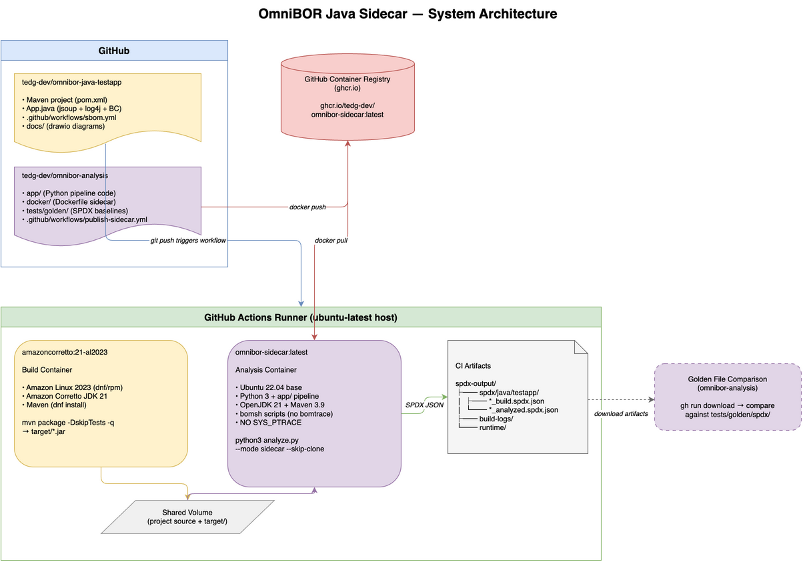
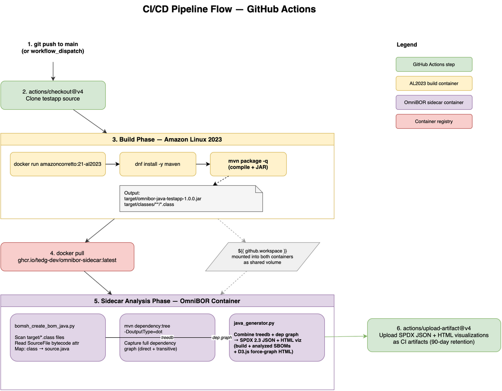
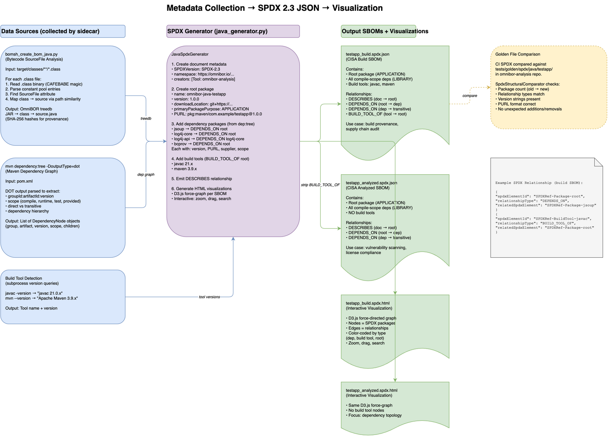

# OmniBOR Analysis Java Sidecar Test Environment

> **This is the Java sidecar test environment.** The
> [omnibor-analysis](https://github.com/tedg-dev/omnibor-analysis)
> project maintains a separate test environment for each supported
> language — each with its own repository, build toolchain, OS, and
> CI/CD pipeline. The goal is to prove that the omnibor-analysis
> sidecar produces correct SPDX SBOMs from any language's build
> artifacts, on any OS, without modifying the build process.
>
> | Language | Test Repository | Build System | CI Build OS |
> |----------|----------------|-------------|-------------|
> | **Java** | **this repo** | Maven / Corretto 21 | Amazon Linux 2023 |
> | C | *(planned)* | make / gcc | *(TBD)* |
> | Go | *(planned)* | go build | *(TBD)* |
> | Rust | *(planned)* | cargo | *(TBD)* |

This project is a realistic Java application that simulates a product
team integrating the omnibor-analysis sidecar container into their
existing CI/CD pipeline to produce SPDX 2.3 SBOMs — without requiring
`SYS_PTRACE`, `strace`, or any modifications to the build process.

The sidecar performs **post-build provenance analysis**: it reads
compiler-inserted `SourceFile` bytecode attributes and queries the
build tool's dependency resolver to produce SBOMs with source → binary
provenance and full dependency hierarchy — capabilities that go beyond
typical SCA tools like Black Duck or Syft. For a detailed technical
assessment including industry comparison and alternative evaluation,
see [Java Sidecar: Analysis Method](docs/java-sidecar-analysis-method.md).

## Architecture

[](docs/architecture.png)
*Click to view full-size diagram ([editable source](docs/architecture.drawio))*

| Component | Description |
|-----------|-------------|
| **Test App** | Maven project depending on jsoup, Log4j2, Bouncy Castle |
| **CI Pipeline** | GitHub Actions: build on Amazon Linux 2023 / Corretto 21 |
| **Sidecar** | `ghcr.io/tedg-dev/omnibor-sidecar` — analyzes build artifacts, generates SPDX |
| **Output** | SPDX 2.3 JSON + HTML visualizations uploaded as CI artifacts |

## Two Independent Containers

The pipeline uses two completely independent containers — different
OS, JDK vendor, and installed software. The build container runs the
project's normal build with zero modifications. The sidecar then
analyzes the artifacts.

| Aspect | CI Build Container | Sidecar Container |
|--------|-------------------|-------------------|
| **Image** | `amazoncorretto:21-al2023` | `ghcr.io/tedg-dev/omnibor-sidecar` |
| **OS** | Amazon Linux 2023 (`dnf`) | Ubuntu 22.04 (`apt`) |
| **JDK** | Amazon Corretto 21 | OpenJDK 17 + 21 |
| **Build runs here?** | **Yes** (`mvn package -q`) | No |
| **SPDX generated here?** | No | **Yes** |
| **SYS_PTRACE** | Not used | Not required |
| **omnibor-analysis tooling** | Not installed | Installed |

## Dependencies

Chosen to exercise different dependency graph shapes:

| Dependency | Version | Why |
|-----------|---------|-----|
| **jsoup** | 1.18.3 | HTML parser — zero transitive deps |
| **Log4j2** | 2.24.3 | Logging — multi-module transitive tree |
| **Bouncy Castle** | 1.80 | Crypto provider — substantial dep tree |
| JUnit 4 | 4.13.2 | Test only — excluded from production SPDX |

## How It Works

[](docs/ci-pipeline-flow.png)
*Click to view full-size diagram ([editable source](docs/ci-pipeline-flow.drawio))*

### 1. Build Phase (Amazon Linux 2023)

The GitHub Actions workflow builds the project inside an
`amazoncorretto:21-al2023` Docker container with an unmodified
`mvn package -q`. This produces
`target/omnibor-java-testapp-1.0.0.jar` with all compiled `.class`
files. No omnibor-analysis tooling is present during the build.

### 2. Sidecar Analysis Phase

After the build completes, the sidecar container analyzes the
artifacts:

- **Bytecode provenance** — reads the `SourceFile` attribute from
  every `.class` file (compiler-inserted per JLS §13.1), creating an
  OmniBOR treedb with SHA-256 hashes linking source → class → JAR
- **Dependency graph** — queries `mvn dependency:tree` for the exact
  resolved dependency hierarchy with scope classification

For technical details on how this compares to standalone mode and
industry SCA tools, see
[Analysis Method](docs/java-sidecar-analysis-method.md).

### 3. SPDX Generation

[](docs/spdx-generation.png)
*Click to view full-size diagram ([editable source](docs/spdx-generation.drawio))*

Both data sources are combined into SPDX 2.3 JSON documents:

| SBOM Type | Contents |
|-----------|----------|
| **Build** | Root package + all deps + build tools (`javac`, Maven) |
| **Analyzed** | Root package + all deps (no build tools) |

SPDX files are uploaded as GitHub Actions artifacts.

## Performance

Each CI run executes two parallel jobs: **baseline** (build only) and
**instrumented** (build + sidecar SPDX). The sidecar adds zero
overhead to the build itself — all analysis runs post-build.

| Run | Baseline | Instrumented Total | Sidecar Analysis | Overhead |
|-----|----------|-------------------|-----------------|----------|
| 6 | 32s | 52s | 20s (14.4s pipeline) | **+63%** |
| 5 | 36s | 56s | 20s (14.1s pipeline) | **+56%** |

## Output

SPDX artifacts from CI runs are stored in `output/spdx/<timestamp>/`:

```
output/spdx/
├── 2026-05-08_2328/                                        # Run #6
│   ├── omnibor-java-testapp-1.0.0_build.spdx.json
│   ├── omnibor-java-testapp-1.0.0_build.spdx.html
│   ├── omnibor-java-testapp-1.0.0_analyzed.spdx.json
│   └── omnibor-java-testapp-1.0.0_analyzed.spdx.html
└── 2026-05-08_2318/                                        # Run #5
    ├── omnibor-java-testapp-1.0.0_build.spdx.json
    ├── omnibor-java-testapp-1.0.0_build.spdx.html
    ├── omnibor-java-testapp-1.0.0_analyzed.spdx.json
    └── omnibor-java-testapp-1.0.0_analyzed.spdx.html
```

- **JSON files** — SPDX 2.3 machine-readable SBOMs
- **HTML files** — Interactive D3.js force-graph visualizations (open in browser)

## Local Development

### Prerequisites

- Java 17+ (any vendor)
- Maven 3.8+

### Build

```bash
mvn package
```

### Run

```bash
java -jar target/omnibor-java-testapp-1.0.0.jar
```

### Test

```bash
mvn test
```

## Documentation

| Document | Description |
|----------|-------------|
| [Analysis Method](docs/java-sidecar-analysis-method.md) | How the sidecar works, industry comparison, fidelity assessment |
| [Architecture](docs/architecture.png) | System architecture diagram ([source](docs/architecture.drawio)) |
| [CI Pipeline Flow](docs/ci-pipeline-flow.png) | Build → analyze → SPDX pipeline ([source](docs/ci-pipeline-flow.drawio)) |
| [Build Observation](docs/build-interception.png) | Standalone vs sidecar comparison ([source](docs/build-interception.drawio)) |
| [SPDX Generation](docs/spdx-generation.png) | Data flow into SPDX 2.3 ([source](docs/spdx-generation.drawio)) |

## License

Apache License 2.0 — see [LICENSE](LICENSE).
